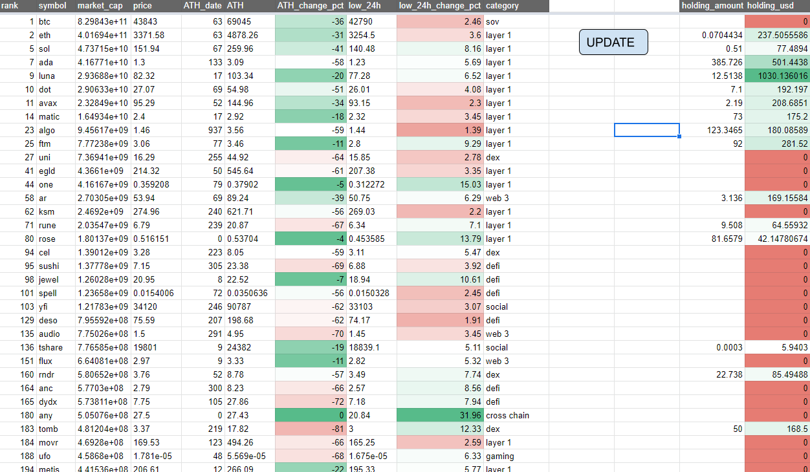
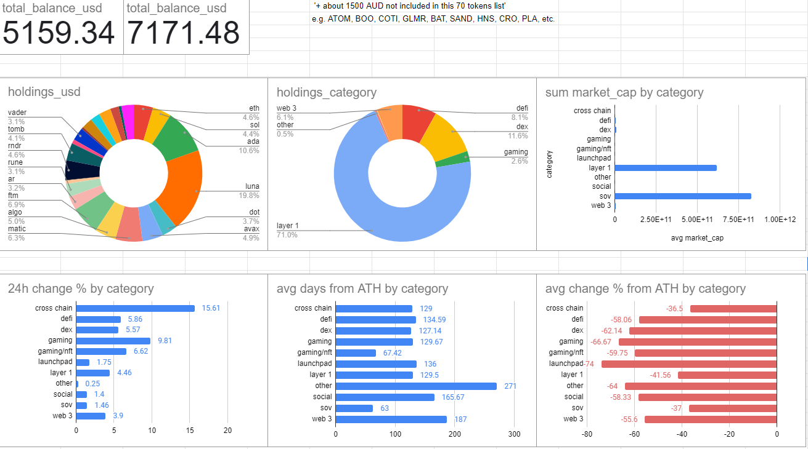

# crypto-realtime-tracker

This is a real-time (if you click update) Crypto market / portfolio tracker that I built for my personal investment in cryptocurrencies.

## Features
By clicking the 'UPDATE' button, various real-time metrics for the 70 tokens that I am interested in are fetched and visualized.
These include:
- price, market cap, market cap rank, all time high price, no. of days since ath, percentage change from ath, recent 24h low, percentage change from recent 24h low, etc.
The point is to identify easily coins that have shot up or coins that still seem to be undervalued. It is also easy to see which sectors/categories I am over/underexposed to. 

On a separate sheet are some basic visualizations of my portfolio and market conditions.

## Examples
Metrics spreadsheet:

Portfolio tracker & market trends:

There aren't that many features/visualizations implemented but hopefully there are more to come!

## Read-only link
link (read-only): https://docs.google.com/spreadsheets/d/1vUgqVLvMaFcxQUQKcKMMlpMCJ_azJD7v649y0OjEhME/edit?usp=sharing
The spreadsheet is read-only so nothing will happen even if you click 'update'.
Sorry, but I need to keep using the free-version of GCP's Cloud Function so I'll keep it to myself for now. 

## Technologies
- Python
- Google Spreadsheet
- Google Spreadsheet Apps Script
- Coingecko API
- GCP Cloud Function

How?
- Python script fetches real-time, updated market data using Coingecko API
- GCP Cloud Function is used to deploy the Python script as a HTTP request on the CLoud
- Apps Script is used to connect the 'button' on the metrics page with the Cloud Function
- Google Spreadsheet is updated and macros are used to produce simple computations & visualizations!

## Requirments
- pandas
- numpy
- pycoingecko
- datetime
- gspread
- oauth2client

